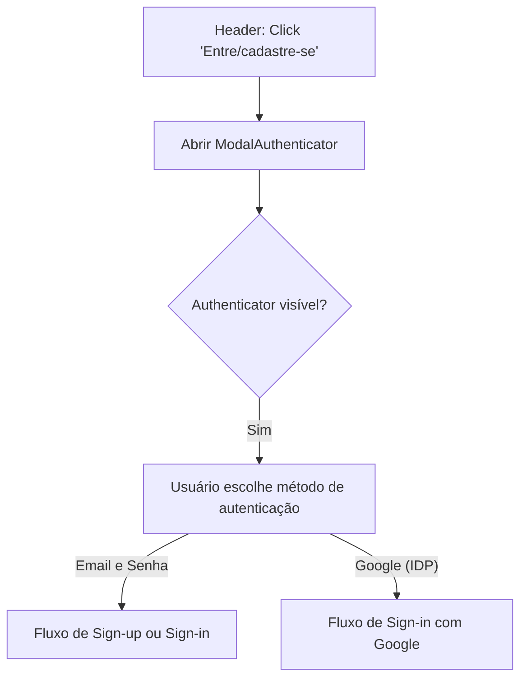
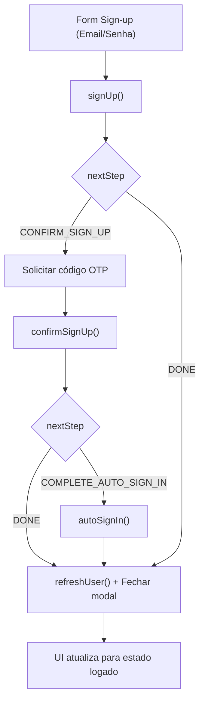
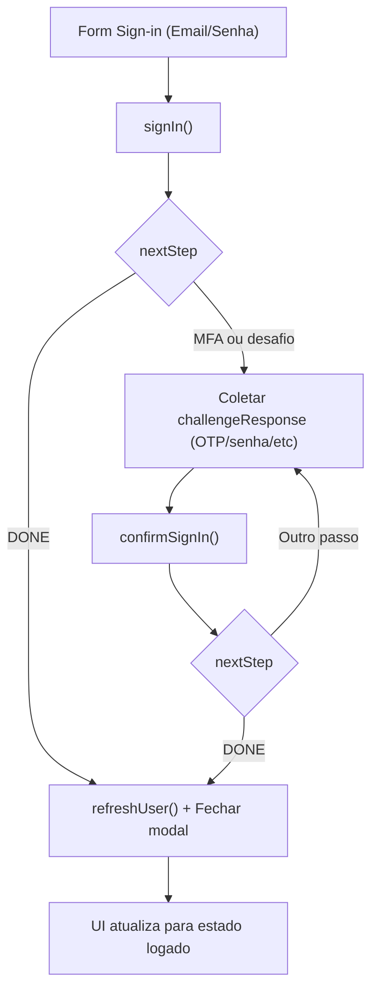
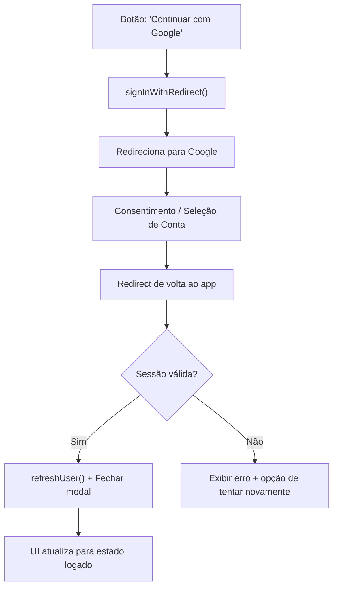
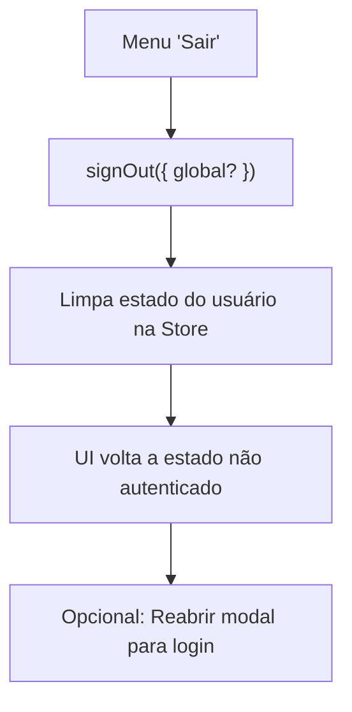
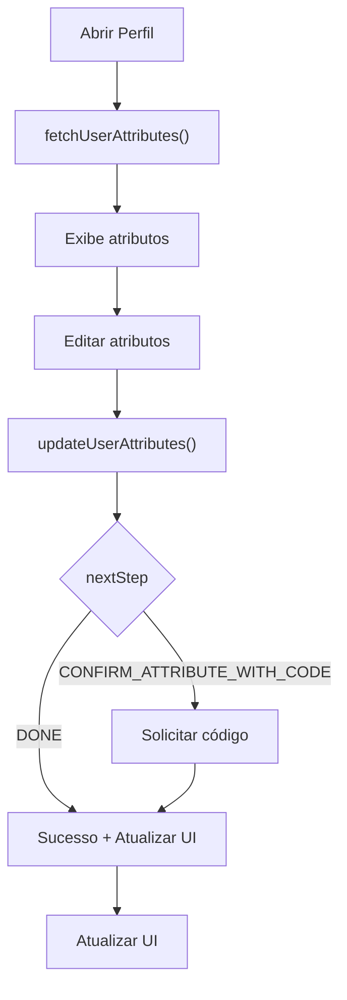

# Fluxos de Autenticação — Fluxogramas (Amplify Gen 2 + Cognito + Vue 3)

Este documento refatora os fluxos para **fluxogramas** (Mermaid flowchart) e incorpora:

- Disparo via botão “Entre/cadastre-se” no Header que abre **modal** com o Authenticator.
- Suporte a **IDP Google** no fluxo atual (via signInWithRedirect ou botão social do Authenticator).
- Sem rotas bloqueadas por enquanto; apenas incluí comentários sobre onde os guards serão adicionados futuramente.

Componentes envolvidos

- Header: botão “Entre/cadastre-se” → abre modal.
- ModalAuthenticator: componente que renderiza o `<authenticator>` do Amplify UI.
- useAuth: composable para ações programáticas e interop com Store quando necessário.
- Store (Pinia): snapshot de sessão, bootstrap, signOut, atributos.
- Amplify Auth/Cognito: backend gerenciado, incluindo Google IDP.
- Router: sem guards ativos agora; comentários de ancoragem deixados.

1. Abertura do modal a partir do Header

- Ao clicar no botão do Header, abrimos o modal e exibimos o Authenticator com opções de Email/Password e Google.



2. Sign‑up (Email) + confirmação + autoSignIn (opcional)

- Registra com e-mail, confirma por código, e pode completar com autoSignIn.



3. Sign‑in (Email/Password) com tratamento de nextStep/MFA

- Clássico password; se MFA/OTP habilitado no futuro, tratar nextStep.



4. Sign‑in com Google (IDP)

- Usuário escolhe “Continuar com Google” no Authenticator (ou botão custom), redireciona e retorna autenticado.



5. Sign‑out (local/global)

- Disponível no menu de usuário (quando autenticado).



6. Gestão de atributos de usuário (Perfil)

- Ler/atualizar; quando atributo exigir verificação, confirmar via código.



Notas de implementação e ancoragens no código

- ModalAuthenticator
  - Local sugerido: src/components/auth/ModalAuthenticator.vue
  - Renderiza `<authenticator>` do pacote @aws-amplify/ui-vue com social provider Google habilitado.
  - Recebe props: visible, onClose. Emite eventos de sucesso (para fechar).
- Header
  - Em [TheHeader](/src/components/shared/TheHeader.vue:1): no botão de login, adicionar @click para abrir o modal.
  - Estado do modal pode ficar em um App-level store leve ou em um provide/inject no App.
- useAuth
  - Local: src/composables/useAuth.ts
  - Expõe: signIn/signUp/confirmSignIn/confirmSignUp/autoSignIn/signOut/fetchUserAttributes/update/confirm/delete
  - Inclui helpers para signInWithRedirect({ provider: 'Google' }).
- Store
  - Local: src/stores/auth.store.ts
  - Ações: bootstrap(), refreshUser(), doSignOut(), etc.
- Guards de rota
  - Não ativar agora. Comentários a inserir no [router]](/src/router/index.ts:1):
  ```ts
  // TODO(auth): quando habilitar rotas protegidas:
  // router.beforeEach(async (to) => {
  // const auth = useAuthStore()
  // if (!auth.currentUser) await auth.bootstrap()
  // if (to.meta.protected && !auth.isLoggedIn) return { name: 'home' /_ ou abrir modal _/ }
  // })
  ```
- IDP Google
  - Backend: configurar Google no Cognito App Client e `externalProviders.google` quando estivermos prontos.
  - Frontend: usar `<authenticator social-providers="google" />` ou `signInWithRedirect({ provider: 'Google' })`.

Considerações de UX

- Modal não deve bloquear navegação; pode ser fechado com ESC e overlay click (com confirmação se houver formulário parcialmente preenchido).
- Exibir feedback de erro amigável; logs apenas em dev.
- Após sucesso, fechar modal e atualizar Header (mostrar avatar/menu).

Métricas de sucesso

- Conversão de login/registro via modal.
- Sucesso de sign-in com Google.
- Persistência da sessão e atualização de UI sem regressões.
