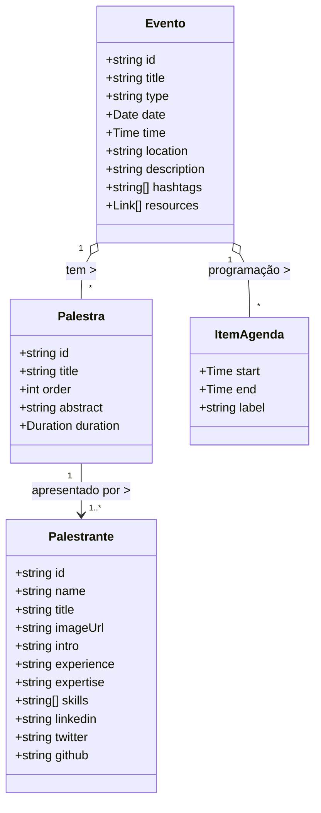

```mermaid
classDiagram
    class Evento {
        +string id
        +string title
        +string type
        +Date   date
        +Time   time
        +string location
        +string description
        +string[] hashtags
        +Link[] resources
    }
    class Palestrante {
        +string id
        +string name
        +string title
        +string imageUrl
        +string intro
        +string experience
        +string expertise
        +string[] skills
        +string linkedin
        +string twitter
        +string github
    }
    class Palestra {
        +string id
        +string title
        +int    order
        +string abstract
        +Duration duration
    }
    class ItemAgenda {
        +Time start
        +Time end
        +string label
    }
    Evento "1" o-- "*" Palestra : tem >
    Palestra  "1" --> "1..*" Palestrante : apresentado por >
    Evento "1" o-- "*" ItemAgenda : programação >
```